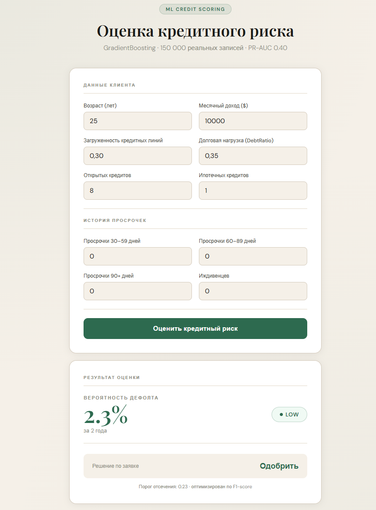
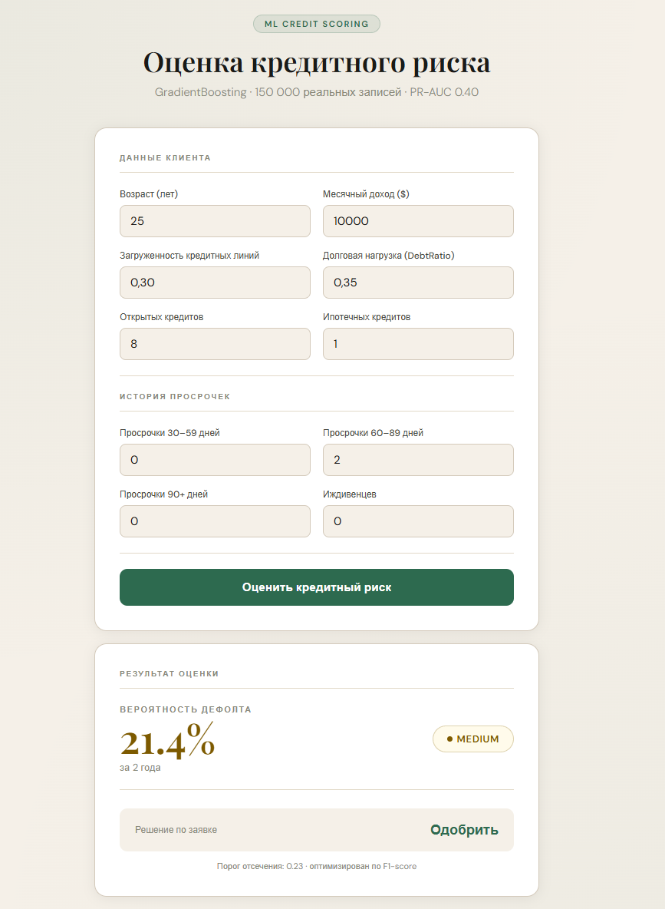
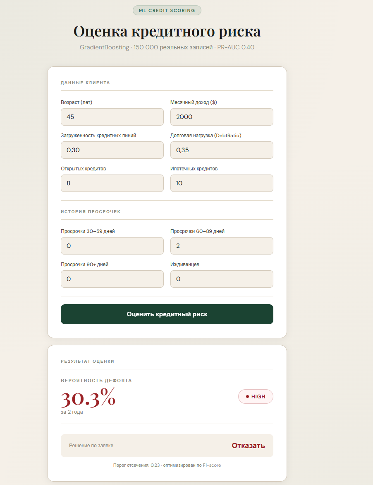
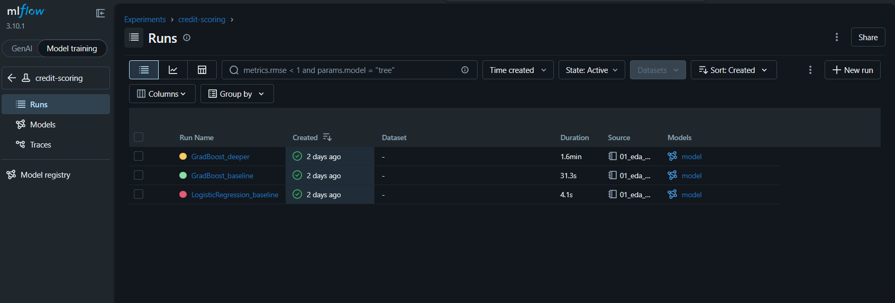

# Credit Scoring ML Platform

> End-to-end credit-risk scoring project built around the Kaggle Give Me Some Credit dataset. It includes reproducible training, FastAPI inference, a web demo, explainability, calibration, threshold analysis, segment error analysis, Docker packaging, tests and MLflow experiment context.


## Model Results

| Model | ROC-AUC | PR-AUC | F1 at threshold 0.23 |
|---|---:|---:|---:|
| Logistic Regression | 0.862 | 0.389 | 0.216 |
| GradientBoosting | 0.868 | 0.400 | 0.448 |

PR-AUC is emphasized because only about 6.7% of borrowers default in the dataset. A high accuracy baseline can simply approve everyone, while PR-AUC and recall expose whether the model finds the minority default class.

The deployed model is the existing GradientBoosting artifact in `models/model.pkl`. The current API contract is preserved: `POST /predict` returns `default_probability`, `risk_level`, `decision` and `threshold_used`.

## Architecture

```text
credit-scoring/
  src/
    api/                 FastAPI routes
    core/                paths, thresholds and shared configuration
    schemas/             Pydantic request/response schemas
    services/            prediction, explainability and telemetry services
    features.py          reusable feature engineering
    train.py             reproducible training CLI
    evaluate.py          calibration and threshold evaluation CLI
    segment_analysis.py  segment-level error analysis CLI
    explain.py           SHAP/global-local explainability CLI
  models/                model, feature names and metadata
  reports/               generated plots, metrics and analysis tables
  docs/                  short technical notes
  tests/                 API, pipeline and service tests
```

The web frontend remains available at `http://localhost:8000`, and Docker still starts the FastAPI app via `uvicorn src.main:app`.

## Demo UI

| LOW - approve | MEDIUM - approve | HIGH - decline |
|:---:|:---:|:---:|
|  |  |  |
| 2.3% probability | 21.4% probability | 30.3% probability |

MLflow experiment context:



## Training Pipeline

Training is no longer notebook-only. Reproduce the model flow with:

```bash
python -m src.train --data data/cs-training.csv --output-dir models
```

The script performs data loading, preprocessing, feature engineering, stratified train/validation split, GradientBoosting training, validation metrics, threshold-aware F1 evaluation, model saving, feature name saving and metadata writing.

Feature engineering is centralized in `src/features.py` and reused by both training and inference:

- `TotalLatePayments`
- `HasAnyLatePayment`
- `DebtPerDependent`
- `IsYoung`
- `LoansPerIncome`

## Calibration and Thresholding

Evaluate probability quality and business cutoffs with:

```bash
python -m src.evaluate --data data/cs-training.csv --output-dir reports
```

Generated artifacts:

- `reports/evaluation_metrics.json`
- `reports/calibration_curve.csv`
- `reports/calibration_curve.png`
- `reports/threshold_analysis.csv`
- `reports/threshold_analysis.png`

Why threshold `0.23`: the original notebook selected it because it materially improves F1 versus the default `0.50` cutoff. The reproducible threshold report compares `0.10`, `0.23`, `0.30` and `0.50` with confusion counts, precision, recall, decline rate and a simple cost framework where false negatives cost more than false positives.

Calibration matters because credit risk scores are used as probabilities, not only as rankings. A poorly calibrated model can produce reasonable AUC while still overstating or understating expected default risk.

## Explainability

Credit decisions need explainability because applicants, reviewers and model owners need to understand which factors drove a risk estimate. This project includes both global and local explanations:

- Global explanation: which features are most influential across a validation sample.
- Local explanation: which features pushed one applicant toward higher or lower estimated default risk.

Generate explainability artifacts with:

```bash
python -m src.explain --data data/cs-training.csv --output-dir reports
```

API endpoints:

- `POST /explain` for a custom applicant payload.
- `GET /explain/sample` for a ready-to-demo local explanation.

Artifacts:

- `reports/shap_summary.png`
- `reports/shap_global_importance.csv`
- `reports/shap_local_sample.json`

The preferred explainer is `shap.TreeExplainer` for the GradientBoosting model. If SHAP is not installed in the active environment, the code falls back to model feature importances so the demo remains functional; this fallback is explicitly less faithful than true SHAP values.

SHAP caveats: contributions are model explanations, not causal proof. Correlated features can share or distort attribution, and explanations inherit all limitations of the training data and model.

## Error Analysis

Run segment analysis with:

```bash
python -m src.segment_analysis --data data/cs-training.csv --output-dir reports
```

Generated artifacts:

- `reports/segment_metrics.csv`
- `reports/segment_recall.png`
- `reports/segment_error_analysis.md`

The analysis reports performance by age bucket, income bucket and late-payment bucket, including confusion-style counts. Current observed weaknesses include lower recall in older age groups and especially borrowers with no explicit late-payment history. High late-payment segments are easier for the model to identify, but this also means the model is more fragile when risk is not expressed through obvious delinquency features.

## API

### `POST /predict`

```bash
curl -X POST http://localhost:8000/predict \
  -H "Content-Type: application/json" \
  -d '{
    "RevolvingUtilizationOfUnsecuredLines": 0.30,
    "age": 45,
    "NumberOfTime30_59DaysPastDueNotWorse": 0,
    "DebtRatio": 0.35,
    "MonthlyIncome": 5000,
    "NumberOfOpenCreditLinesAndLoans": 8,
    "NumberOfTimes90DaysLate": 0,
    "NumberRealEstateLoansOrLines": 1,
    "NumberOfTime60_89DaysPastDueNotWorse": 0,
    "NumberOfDependents": 0
  }'
```

Example response:

```json
{
  "default_probability": 0.0213,
  "risk_level": "LOW",
  "decision": "Одобрить",
  "threshold_used": 0.23
}
```

### Additional Endpoints

- `GET /health` returns service status, model family, threshold and feature count.
- `GET /model/info` returns model name, version, threshold, feature count, training timestamp if available and positive class rate if available.
- `POST /explain` returns local risk drivers for one applicant.
- `GET /explain/sample` returns a demo explanation.
- `GET /metrics` returns request count, prediction count, error count and latency metrics.

Inference events are written locally to `logs/inference_log.jsonl` with `request_id`, timestamp, probability, risk level and decision. The log directory is intentionally git-ignored.

## Demo Scenario

1. Start the service:

```bash
uvicorn src.main:app --reload
```

2. Check health:

```bash
curl http://localhost:8000/health
```

3. Score an applicant with `POST /predict`.

4. Explain the same applicant with `POST /explain` or use:

```bash
curl http://localhost:8000/explain/sample
```

5. Inspect runtime metrics:

```bash
curl http://localhost:8000/metrics
```

6. Review generated artifacts in `reports/`: calibration, threshold analysis, segment error analysis and explainability plots/tables.

## Retraining Instructions

```bash
python -m venv venv
venv\Scripts\activate
pip install -r requirements-dev.txt
python -m src.train --data data/cs-training.csv --output-dir models
python -m src.evaluate --data data/cs-training.csv --output-dir reports
python -m src.segment_analysis --data data/cs-training.csv --output-dir reports
python -m src.explain --data data/cs-training.csv --output-dir reports
pytest -q
```

The notebook can still be used for exploration, but it is no longer the only way to train or evaluate the project.

## Quick Start

### Docker

```bash
git clone https://github.com/IlliaSator/credit-scoring.git
cd credit-scoring
docker-compose up -d
```

Web UI: `http://localhost:8000`
Swagger API: `http://localhost:8000/docs`

### Local

```bash
python -m venv venv
venv\Scripts\activate
pip install -r requirements.txt
uvicorn src.main:app --reload
```

## Tests

```bash
pip install -r requirements-dev.txt
pytest -q
```

The suite covers API validation, feature engineering, model artifact loading, threshold rules, explanation endpoints, service metrics and model metadata.

## Data

Dataset: Give Me Some Credit on Kaggle.

- 150,000 borrower records.
- 10 original applicant features plus engineered risk features.
- Target: serious delinquency within two years.
- Positive class rate: about 6.7%.

Place `cs-training.csv` in `data/` before retraining.

## Trade-offs and Limitations

- Dataset limitations: the Kaggle dataset is historical, anonymized and does not represent a full modern credit bureau or underwriting system.
- Class imbalance: defaults are rare, so threshold and recall choices strongly affect business outcomes.
- Threshold is business-dependent: `0.23` is a demo policy based on F1 and illustrative costs, not a universal lending rule.
- Explainability is approximate: SHAP explains model behavior, not real-world causality, and correlated features can affect attribution.
- Production gaps: this project intentionally does not implement full authentication, a database-backed audit trail, a production model registry or fairness governance workflows.

## Stack

Python 3.11, scikit-learn, pandas, SHAP, FastAPI, Pydantic, Matplotlib, Docker, pytest, MLflow experiment context and GitHub Actions.
